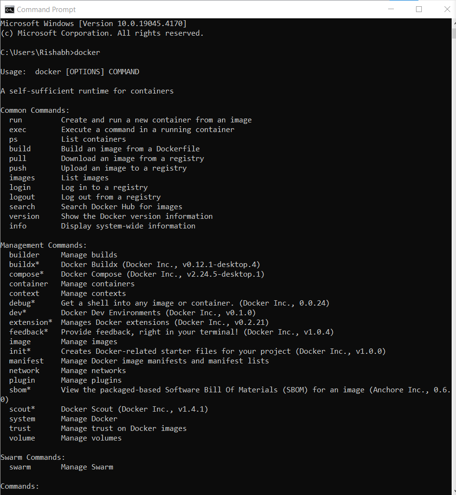

# Docker
1. **What's Docker?**

   Docker ek platform hai jisse aap applications develop, ship, aur run kar sakte hain. Docker aapko aapke applications ko aapke infrastructure se alag rakhne ki suvidha deta hai, jisse aap software ko tezi se deliver kar sakte hain. Docker ke madhyam se aap apne infrastructure ko waise hi manage kar sakte hain jaise aap aapke applications ko manage karte hain. Docker ke methodologies ka istemal karke aap code ko ship, test, aur deploy karne mein delay ko kam kar sakte hain, jisse code likhne aur use production mein chalane mein kam samay lagta hai.

2. **Why do we need Docker?**

   - Like agar aap kisi company me developer ho aur man lo aapne ek project bnaya pr ab aap project bada ho gya h or suppose company ne aur bande allot kr diye ki aap bhi isi project pe kam kro to maan lo aapne project bnaya tha kuch apni configuration pe like -

     Your configuration-
     - os - windows 10
     - tech - node 18.0.1

     lekin agar aapke project pe kam krne wale kisi aur bande ka config. -
     - os - mac
     - tech - node 16.1.2

     hai to project kbhi kam krega hi n phir aap usko bologe ki bhai tum bhi node k version ko upgrade kar lo pr man lo uske apne projects jo k usne node 16.1.2 pe banye h phir wo kam n krenge agar usne upgrade kiya to.

     in conditions se bachne ke liye docker use krte h. 

3. **How does Docker work?**

   like agar layman language me bolu to hame docker engine ki jrurt padti h jo ki alg-alg containers banata krta h jiske andar hame kya tech stack use krna kya os use krna h etc install krte h images k form me jo har container k andar images installed hote h jo ki aapke host/original config pe asar nhi krte nahi uspe depended rahte h (ha space pe depended rahte h as jo images ham install krte h ho kbhi kbhar kafo sapce consume krte h).
     To agar 4 log milke ek project bana rhe h to phle hi docker container bna lete h phir uske andar apne hisab se images install krke project ko bnate h taki sabk config. same rahe aur kisi ko dikkat na ho.

4. **Docker Architecture?**

   
   - docker waise client-server achitecture use krta h. docker client sabse phle docker daemon se contact krta h joki normally sare heavy tasks jaise building, distributions etc sambhalta hai.
   docker client __(docker)__ and docker daemon REST api use krte h connections ke liye.
   - ab docker daemon __(dockerd)__ listen krta h sare docker api requests ko aur manage bhi karta h docker images/containers ko.
   
   - suppose aapne __"docker run"__ command likha to sabse phle client phle command ko docker daemon ke pas bhejta h joki use execue krta h.
   - ek docker client kayi docker daemon se communicate kar sakta h.
   
   - __docker deskop__ ek gui application h jisse docker daemon , contaner , images etc install hote h aapke local pc pe aur is application k madad se aap manage bhi kar sakte h apne docker container/volumes/images ko aasani se.
   
   - __docker registries__ store karti h docker images ko.
   - __docker hub__ bilkul hithub h pr docker images ka like agar ham koi image run krte h aur wo install nhi h to wo automatic docker hub se install ho jata h.

5. **Docker Containers**

   - jaise aapne oops me pda hai ki objects are instance of class usi tarah container runnable instance hote h images ke. in containers ke andar hi docker images instal hote h.
   - containers generally dusre containers aur host machine se bilkul isolated hote h.
   - agar aap containers ko delete karte hai to uske andar ke images ya sara data , states sab delete ho jata h par aap use restore kar sakte h agar aap persistent volumes ka use kare data store krne k liye like kubernetes.

      - `docker run -it ubuntu`

   - agar aap is command ko run kre to docker ek ubuntu (image) wale container ko run krega.
   - docker generally hmesa new containers create krta h jb bhi aap specific kisi container ka nam ya unique id deke na run kre command to.

6. **Docker Images**

   - image ek instructions se bhara read only template hota h jisse docker container create hote h.
   - aksar ek image kisi dusre image pe based hota h like aap koi image build kr skte jo ki ubuntu image pe based ho aur aap uspe apache web server ya busybox install kare.
   - like docker images ko banane ke liye hm __Dockerfile__ file ka use karte h jisme likha har command image me ek layer create krta h. 
   - agar ham __Dockerfile__ me kuch bhi change ya update karte h aur image ko rebuild karte h to sirf whi layer phir se run hote h jinme kuch change hota h isliye docker images bhut __fast__ aur lightweight hote h.

7. **Docker Installation**
   - sabse phle docker desktop download krna h official website se according to your os.
     
   
   - uske baad docker ko install krne k baad use open krna hai.
     
   
   - uske baad aapko kuch aisa dikhega ki docker setup ho rha h. uske baad turant docker kul jatega.docker aapke system tray menu me bhi chla jata h open krne k baad.
     
   
   - uske baad check kr skte h ki docker install hua h ya n to phle command prompt open kr le aur usme __docker__ ya __docker -v__ run kre.
     
   
   - to aapko agar kuch aisa dikh rha h to congrats aap ke pc me docker install ho chuka h. aap chahe to kisi image ko pull krke bhi dekh skte h.
     
   
